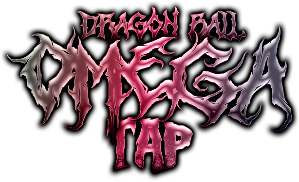

# Dragon Ball Omega Tap

<div align="center">
  
</div>

## What is *Dragon Ball Omega Tap*?

*Dragon Ball Omega Tap* (Or Dragon Ball Omega Omniverse) is a fast-paced browser game where the goal is to charge up and unleash a massive Kamehameha against a Dragon Ball character. Players must tap the **Spacebar** rapidly to build energy and overpower their opponent in an epic battle of strength and determination.

This simple and engaging game is designed for fans of the *Dragon Ball* universe and casual gamers alike.

---

## How to Play

1. **Start the Game**:  
   - Play directly on the [GitHub Pages link](https://ethancarollo.github.io/dragon-ball-omega-tap/)  
   - Or download the project and open `index.html` in your browser.

2. **Objective**:  
   - Build up your energy bar as quickly as possible by tapping the **Spacebar**. Once the bar is full, unleash a devastating Kamehameha to defeat your opponent.

3. **Controls**:  
   - **Spacebar**: Tap repeatedly to charge your energy.

4. **Win Condition**:  
   - Fill your energy bar before the time runs out and watch your opponent crumble under your ultimate attack.

---

## Development Requirements

To develop or modify *Dragon Ball Omega Tap*, you will need:

- **A modern web browser**: Supports HTML5, CSS3, and JavaScript.
- **A code editor**: Preferably [VS Code](https://code.visualstudio.com/) or another lightweight editor.
- **Git**: To clone the repository if you plan to make changes.

### Setting Up the Project

1. Clone the repository:  
   ```bash
   git clone https://github.com/EthanCarollo/dragonball-omega-tap.git
   ```
2. Open the project folder:  
   ```bash
   cd dragonball-omega-tap
   ```
3. Open `index.html` in your browser to play or edit.

---

## Disclaimer

This game is a fan-made project based on the Dragon Ball franchise, which is owned by Toei Animation, Shueisha, and Akira Toriyama. The game is created solely for non-commercial, fan appreciation purposes.  

This project is not endorsed, approved, or affiliated with the official Dragon Ball creators. If requested by the copyright holders, I will remove or modify the game accordingly.
